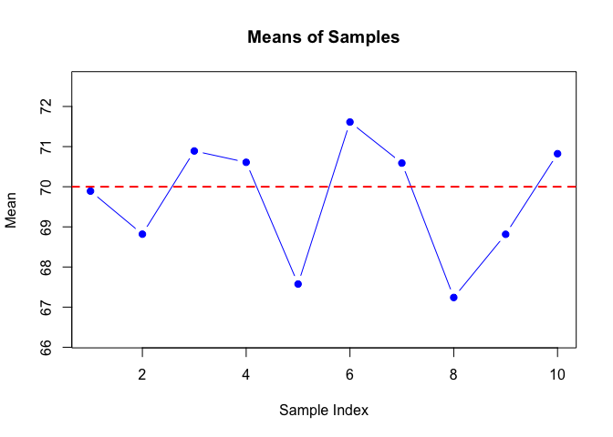
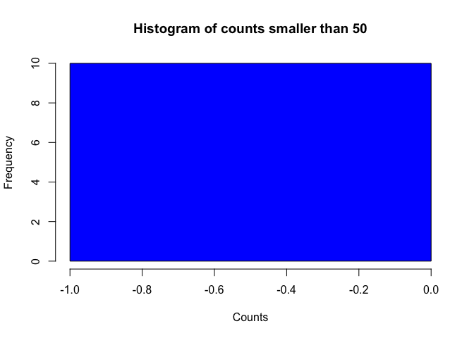

<!-- README.md is generated from README.Rmd. Please edit that file -->

# FinalProj561

<!-- badges: start -->
<!-- badges: end -->

The goal of FinalProj561 is to generate several samples contains values
follow a normal distribution. Then made statistical summary by number
and graphs.

PkgDown URL: <https://chenyihan1999.github.io/FinalProj561/>

GitHub URL: <https://github.com/CHENYIHAN1999/FinalProj561>

## Installation

You can install the development version of FinalProj561 like so:

``` r
devtools::install_github("CHENYIHAN1999/FinalProj561")
#> Downloading GitHub repo CHENYIHAN1999/FinalProj561@HEAD
#> ── R CMD build ─────────────────────────────────────────────────────────────────
#> * checking for file ‘/private/var/folders/r3/yrz1fzw94m3878_9vqn6sc080000gn/T/RtmphCZwyy/remotesfcbf3984fac/CHENYIHAN1999-FinalProj561-0a4cc1e/DESCRIPTION’ ... OK
#> * preparing ‘FinalProj561’:
#> * checking DESCRIPTION meta-information ... OK
#> * checking for LF line-endings in source and make files and shell scripts
#> * checking for empty or unneeded directories
#> * building ‘FinalProj561_0.0.0.9000.tar.gz’
#> Installing package into '/private/var/folders/r3/yrz1fzw94m3878_9vqn6sc080000gn/T/RtmpOYYRfr/temp_libpathd9352bb11025'
#> (as 'lib' is unspecified)
```

Upon completion, you can run the following code (in R):

``` r
library(FinalProj561)
```

## Example

This is a basic example which shows you how to solve a common problem:

``` r
library(FinalProj561)

result <- generate_samples(5, 10, 70, 3.3)
mean_result <- calculate_means_and_plot(result)
```



``` r
samples_result <- result$samples
count_result <- count_values_and_plot_histogram(samples_result, 50, "smaller")
```



# Session info

This package was developed in the following environment

``` r
devtools::session_info()
#> ─ Session info ───────────────────────────────────────────────────────────────
#>  setting  value
#>  version  R version 4.3.1 (2023-06-16)
#>  os       macOS Monterey 12.5.1
#>  system   aarch64, darwin20
#>  ui       X11
#>  language (EN)
#>  collate  en_US.UTF-8
#>  ctype    en_US.UTF-8
#>  tz       America/Los_Angeles
#>  date     2024-06-06
#>  pandoc   3.1.1 @ /Applications/RStudio.app/Contents/Resources/app/quarto/bin/tools/ (via rmarkdown)
#> 
#> ─ Packages ───────────────────────────────────────────────────────────────────
#>  package      * version    date (UTC) lib source
#>  cachem         1.0.8      2023-05-01 [2] CRAN (R 4.3.0)
#>  callr          3.7.3      2022-11-02 [2] CRAN (R 4.3.0)
#>  cli            3.6.2      2023-12-11 [2] CRAN (R 4.3.1)
#>  curl           5.2.0      2023-12-08 [2] CRAN (R 4.3.1)
#>  desc           1.4.3      2023-12-10 [2] CRAN (R 4.3.1)
#>  devtools       2.4.5      2022-10-11 [2] CRAN (R 4.3.0)
#>  digest         0.6.33     2023-07-07 [2] CRAN (R 4.3.0)
#>  ellipsis       0.3.2      2021-04-29 [2] CRAN (R 4.3.0)
#>  evaluate       0.23       2023-11-01 [2] CRAN (R 4.3.1)
#>  fastmap        1.1.1      2023-02-24 [2] CRAN (R 4.3.0)
#>  FinalProj561 * 0.0.0.9000 2024-06-06 [1] Github (CHENYIHAN1999/FinalProj561@0a4cc1e)
#>  fs             1.6.3      2023-07-20 [2] CRAN (R 4.3.0)
#>  glue           1.7.0      2024-01-09 [2] CRAN (R 4.3.1)
#>  highr          0.10       2022-12-22 [2] CRAN (R 4.3.0)
#>  htmltools      0.5.7      2023-11-03 [2] CRAN (R 4.3.1)
#>  htmlwidgets    1.6.4      2023-12-06 [2] CRAN (R 4.3.1)
#>  httpuv         1.6.15     2024-03-26 [2] CRAN (R 4.3.1)
#>  knitr          1.45       2023-10-30 [2] CRAN (R 4.3.1)
#>  later          1.3.2      2023-12-06 [2] CRAN (R 4.3.1)
#>  lifecycle      1.0.4      2023-11-07 [2] CRAN (R 4.3.1)
#>  magrittr       2.0.3      2022-03-30 [2] CRAN (R 4.3.0)
#>  memoise        2.0.1      2021-11-26 [2] CRAN (R 4.3.0)
#>  mime           0.12       2021-09-28 [2] CRAN (R 4.3.0)
#>  miniUI         0.1.1.1    2018-05-18 [2] CRAN (R 4.3.0)
#>  pkgbuild       1.4.3      2023-12-10 [2] CRAN (R 4.3.1)
#>  pkgload        1.3.4      2024-01-16 [2] CRAN (R 4.3.1)
#>  processx       3.8.3      2023-12-10 [2] CRAN (R 4.3.1)
#>  profvis        0.3.8      2023-05-02 [2] CRAN (R 4.3.0)
#>  promises       1.2.1      2023-08-10 [2] CRAN (R 4.3.0)
#>  ps             1.7.5      2023-04-18 [2] CRAN (R 4.3.0)
#>  purrr          1.0.2      2023-08-10 [2] CRAN (R 4.3.0)
#>  R6             2.5.1      2021-08-19 [2] CRAN (R 4.3.0)
#>  Rcpp           1.0.12     2024-01-09 [2] CRAN (R 4.3.1)
#>  remotes        2.4.2.1    2023-07-18 [2] CRAN (R 4.3.0)
#>  rlang          1.1.3      2024-01-10 [2] CRAN (R 4.3.1)
#>  rmarkdown      2.25       2023-09-18 [2] CRAN (R 4.3.1)
#>  rstudioapi     0.16.0     2024-03-24 [2] CRAN (R 4.3.1)
#>  sessioninfo    1.2.2      2021-12-06 [2] CRAN (R 4.3.0)
#>  shiny          1.8.1.1    2024-04-02 [2] CRAN (R 4.3.1)
#>  stringi        1.8.3      2023-12-11 [2] CRAN (R 4.3.1)
#>  stringr        1.5.1      2023-11-14 [2] CRAN (R 4.3.1)
#>  urlchecker     1.0.1      2021-11-30 [2] CRAN (R 4.3.0)
#>  usethis        2.2.3      2024-02-19 [2] CRAN (R 4.3.1)
#>  vctrs          0.6.5      2023-12-01 [2] CRAN (R 4.3.1)
#>  xfun           0.41       2023-11-01 [2] CRAN (R 4.3.1)
#>  xtable         1.8-4      2019-04-21 [2] CRAN (R 4.3.0)
#>  yaml           2.3.8      2023-12-11 [2] CRAN (R 4.3.1)
#> 
#>  [1] /private/var/folders/r3/yrz1fzw94m3878_9vqn6sc080000gn/T/RtmpOYYRfr/temp_libpathd9352bb11025
#>  [2] /Library/Frameworks/R.framework/Versions/4.3-arm64/Resources/library
#> 
#> ──────────────────────────────────────────────────────────────────────────────
```
